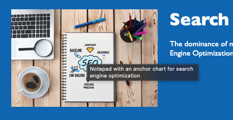
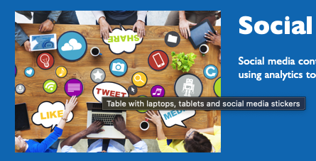
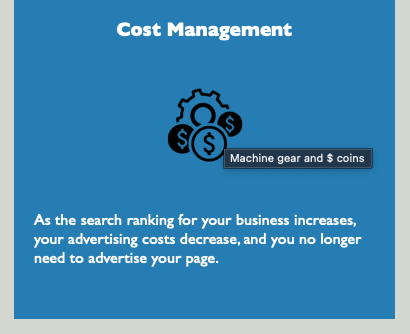

# 01_Homework - Accessibility Code Refactor

## Project Description

To increase the search rankings of the Horiseon website and make it more accessible to more users, the existing code was refactored.  By applying HTML sementics and consolidating the CSS code, the website is now more efficient and has had comments added to help with future improvements.  

## Table of Contents 

- [About the Project](#about-the-project)
- [Installation](#installation)
- [Credit](#credit)
- [License](#license)

## About the Project

- This project was built to make the website more accessible to people with disabilities as well as to increase the search rankings of this website.
- Motiviation for this project was to improve the accessibility of the website for disabled viewers and to improve the code for long term sustainability.
- HTML sementics have been applied and the selectors in the CSS code have been consolidated to increase the efficiency of the website.
- Comments have been added to both the HTML and CSS files to communicate elements and selectors.
- Broken links found in the project have been fixed to ensure that all links work as they were intended.
- By refactoring the existing code, the website is now more accessible to a wider range of users, allowing the website to rank higher on search engines.

## Installation

1. Open index.html in your internet browser.
2. Hover over pictures to see accessibility improvements.

 \
\
 \
\
 \
\
 

## Credit

- Existing code created by Horiseon. 

## License

- &copy; 2019 Horiseon Social Solution Services, Inc.